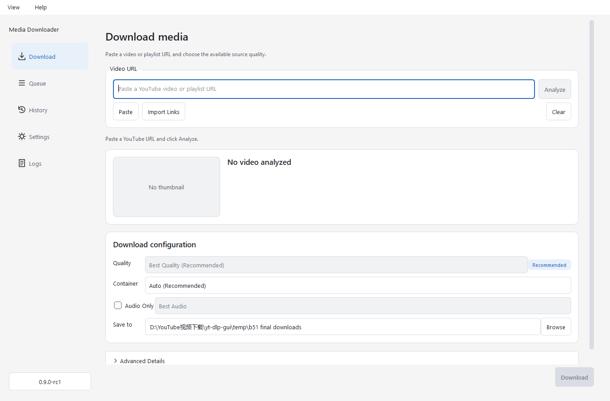

# Media Downloader · 视频下载器

基于 yt-dlp 和 PySide6 的桌面视频下载工具，支持简体中文、英语、浅色与深色主题。



## 普通用户：下载后双击就用

**Windows 10（19045+）/ Windows 11，64 位：**

[下载一键启动版（EXE）](https://github.com/qiyao111111/media-downloader/releases/download/v0.9.0-rc2-easy/MediaDownloader-Easy-Windows-x64.exe)

下载完成后双击这个文件，等待自动展开并打开软件。**无需解压、选择安装目录、安装 Python/FFmpeg 或配置环境**。首次使用默认中文、最高源画质，保存到自己的“下载/MediaDownloader”文件夹。

使用时：**粘贴链接 → 解析 → 下载**。程序会自动展开到 `%LOCALAPPDATA%\MediaDownloader-Easy`；以后也可直接启动其中的 `MediaDownloader.exe`。

当前文件未签名，Windows 可能出现安全提示。它是候选版，独立干净 Windows 验收与分发许可复核仍待完成；部分网站仍可能需要你自己的登录状态或网络代理。

代码签名尚未完成。[签名状态与接入步骤](docs/WINDOWS_SIGNING.md) 说明如何为 GitHub EXE 加入可信签名；签名也不能保证新版本立即没有 SmartScreen 提示。

## 项目状态

当前版本 **0.9.0-rc2**。这是基于 [Plutoeat/yt-dlp-gui](https://github.com/Plutoeat/yt-dlp-gui) 继续开发的独立项目，保留原作者 MIT 许可。本仓库公开源码、构建脚本、测试和开发记录。

Windows 一键启动包为未签名候选版；独立干净 Windows 验收与第三方二进制分发条款复核尚未完成。普通用户使用上面的下载入口，开发者可按下方步骤运行源码。详见 [RC2 说明](RELEASE_NOTES_0.9.0-rc2.md)。历史报告中的本机路径和阶段结论仅用于开发记录。

## 功能

- 粘贴链接 → 解析视频 → 选择画质、封装格式和目录 → 下载。
- 显示视频源实际提供的画质和 HDR 信息，支持最高画质及仅音频下载。
- 下载队列、进度、取消与重试；保存设置和历史。
- 支持字幕、代理和 cookies.txt；浏览器 cookies 提取为实验性或尽力支持。
- 中英界面、浅深主题、运行环境诊断和本地日志。

## 从源码运行（Windows）

安装 Python **3.13+** 和 Git，在 PowerShell 中执行：

```powershell
git clone https://github.com/qiyao111111/media-downloader.git
cd media-downloader
python -m venv .venv
.venv\Scripts\python.exe -m pip install -e .
.venv\Scripts\python.exe main.py
```

合并视频与音频、转音频和字幕后处理需要 FFmpeg/FFprobe。把它们加入 PATH，或放入项目 `bin/` 目录；在“设置 → 运行环境”检查实际检测结果。源码运行不自动下载原生运行时。

部分 YouTube 视频需要 JavaScript 运行时。当前代码使用 QuickJS，项目内位置为 `bin/runtime/qjs.exe`。可通过下面的 Windows 构建流程准备项目固定的原生运行时；FFmpeg/QuickJS 版本、来源与校验信息见 `build/native-runtime-lock.json` 和 [运行时说明](docs/B4_3_RUNTIME_SIMPLIFICATION.md)。缺少 QuickJS 时，部分格式可能不可用。

也可使用 `uv sync` 后执行 `uv run python main.py`。`requirements-lock.txt` 是 Windows 构建环境的固定依赖清单。

## 使用

1. 首次启动选择语言和保存目录。
2. 在下载页面粘贴视频链接，点击解析。
3. 选择源画质、封装格式或音频模式，开始下载。
4. 在队列中查看进度、取消或重试，在历史页面查看已完成任务。

需要登录的内容可在“设置 → Cookies”选择自己的 cookies.txt。不要上传或分享该文件。网络、代理、网站限制和上游认证挑战可能导致失败；软件不保证所有链接都可下载。AV1/VP9/Opus 文件需要兼容播放器。

源码模式的数据位于项目下 `configs/`、`data/`、`logs/`、`temp/`，默认下载目录为 `video/`。这些个人运行数据不会提交到仓库。

## 开发与构建

[贡献说明](CONTRIBUTING.md) 包含离线测试命令。GitHub Actions 自动执行基础源码回归，并检查 Python wheel 是否包含入口、翻译和样式资源。

Windows x64 构建环境使用 Python 3.13；安装 `requirements-lock.txt` 中的依赖，将 Inno Setup 6.7.3 的编译器放入 `.tools/inno/`，再执行：

```powershell
.venv\Scripts\python.exe -m pip install -r requirements-lock.txt
.venv\Scripts\python.exe build_windows.py
```

首次构建需要网络，脚本校验下载输入并在 `dist/release/` 生成便携包、安装器、校验和、许可与源码材料。部分原生运行时缓存需依照 [FFmpeg 构建记录](docs/B4_3_FFMPEG_BUILD.md) 和 `build_native_runtime.py` 的工具路径要求先行准备；这不是仅凭 Python 即可完成的跨平台打包流程。历史 [构建指南](docs/B4_BUILD_GUIDE.md) 描述早期 RC1，运行时基线以 RC2 和当前 lock 为准。

```text
app/         应用路径、版本和验收入口
core/        下载任务、队列、格式选择、凭据处理
models/      数据与错误模型
services/    设置、历史、日志等服务
gui/         PySide6 页面、控件与样式
i18n/        中文和英文翻译
configs/     默认下载配置
build/       Windows 打包配置及运行时锁定信息
redistribution/ 第三方许可、源码与再分发材料
tests/       回归测试和验收脚本
docs/        架构、验证记录和截图
```

## 许可与反馈

项目源码使用 [MIT License](LICENSE)。第三方组件保留各自许可；项目 MIT 不替代 Qt/PySide6、FFmpeg 等组件的分发义务。只下载你有权保存和使用的内容。

欢迎在 [Issues](https://github.com/qiyao111111/media-downloader/issues) 提交脱敏后的复现步骤。请参阅 [贡献说明](CONTRIBUTING.md)。

## 构建一键启动包

先按 Windows 构建流程准备 `dist/MediaDownloader/`（包含原生运行时及许可/对应源码材料），再执行：

```powershell
.tools\inno\ISCC.exe /DAppVersion=0.9.0-rc2 /DWindowsVersion=0.9.0.2 build/easy.iss
```

输出 `dist/release/MediaDownloader-Easy-Windows-x64.exe`。它自动展开到当前用户目录后启动；不会提升权限、修改 PATH 或创建卸载项。`build/easy-defaults.json` 只在用户没有设置文件时写入，保留已有设置和下载历史。
