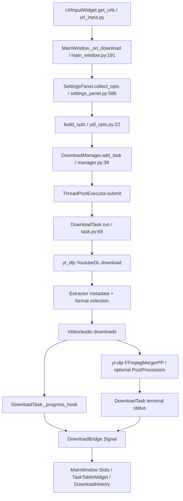

# B0 架构审计

审计基线：`0e42112dae627c10ce159ece0ef97594ccd27d39`。文件行号均指该提交。只读分析，无产品代码修改。

## 目录与模块

| 层/模块 | 真实文件与类/函数 | 职责 |
|---|---|---|
| 入口 | `main.py:15 main` | QApplication、主题、MainWindow、事件循环 |
| 主窗口/下载页面 | `gui/main_window.py:29 MainWindow` | URL、预设、任务表、日志；没有独立 DownloadController |
| URL | `gui/widgets/url_input.py UrlInputWidget.get_urls` | 按行解析、去重、忽略 # 注释；不验证 URL scheme |
| 设置 | `gui/widgets/settings_dialog.py SettingsDialog` / `settings_panel.py SettingsPanel` | 六个折叠区、收集与恢复设置 |
| 历史页面 | `gui/main_window.py:152 _load_history` / `task_table.py TaskTableWidget` | 历史与当前任务同表；无独立历史页面 |
| 对话框 | `FormatPreviewDialog`、`SettingsDialog`、QInputDialog、QMessageBox、QFileDialog | 格式、设置、预设命名、提示、路径 |
| Qt 通信 | `gui/bridge.py DownloadBridge` | progress、status_changed、error、info_extracted、info_error Signal；MainWindow 对应 Slot |
| 下载 Worker | `core/manager.py DownloadManager` / `core/task.py DownloadTask.run` | ThreadPoolExecutor；没有 QThread |
| 解析 Worker | `core/manager.py:85 extract_info` / `core/info_extractor.py:8 extract_info` | 同一线程池；YoutubeDL.extract_info(download=False) |
| 参数 | `configs/ydl_opts.py:22 build_opts` | YAML → 合并 GUI 参数 → 后处理器 → 字段转换 → 清理 |
| 格式 | `configs/presets.py BUILTIN_PRESETS` / `core/ffmpeg_utils.py:23 get_default_format` | 预设与自动选择 |
| 持久化 | `AppSettings` / `DownloadHistory` / `PresetManager` | 根目录 configs 下三个 JSON；无 SQLite/QSettings/Registry |
| 主题与资源 | `gui/theme_manager.py`、`gui/styles/*.qss`、`assets/*.png` | 相对 __file__ 加载 QSS；PNG 为 README 截图 |
| 构建 | `pyproject.toml`、`.python-version`、`.gitignore` | Python 3.13、依赖；没有打包配置、CI、测试套件 |

所有受控 Python 源文件已阅读；空 `__init__.py`、QSS、YAML、README、LICENSE、Git 元信息已检查。不存在 requirements.txt/setup.py/AGENTS.md。

## 下载调用链



GUI 的“List Formats”是另一条链：`_on_list_formats:240 → DownloadManager.extract_info:85 → core.info_extractor.extract_info:8 → YoutubeDL.extract_info`，回传 Signal 后打开 FormatPreviewDialog。GUI **未给这一调用传 ydl_opts**，所以代理/Cookies/FFmpeg 设置不生效。标题和 formats 会展示；thumbnail URL 在 info_dict 中存在，但界面没有封面图加载逻辑。

下载不要求先预览：加任务后，yt-dlp 内部解析并选格式。没有持久化任务选中的格式、输出路径、原始参数或播放列表子项。

## 格式选择

默认检测到 PATH ffmpeg 时为 `bv*+ba/b`，没有时为 `b`（`ffmpeg_utils.py:23`）。`b/best` 是最佳单文件，不等于最高分辨率视频加最佳音频。源码工具提示正确区分二者，但缺少 ffmpeg 时自动降级会损失高分辨率。

| 目标 | 实现/限制 |
|---|---|
| 1080P | 预设 `bv*[height<=1080]+ba/b[height<=1080]`，是上限，不保证源一定有 1080P |
| 1440P/2160P/4320P | 没有专用预设；可手输 `bv[height=1440]+ba` 等；默认不设分辨率上限；8K 未实测 |
| AV1/VP9/H264 | 格式表有 vcodec，可手输 codec 条件；本次视频真实返回三类；不自动保证播放器兼容性 |
| HDR | 无专用 HDR 开关；委托 yt-dlp 格式/排序；未做 HDR 源测试 |
| 最佳视频/音频 | 默认 bv*+ba；遵循 yt-dlp 排序，非绝对最高码率；用户 sort 可影响选择 |
| Best MP4 | 优先 mp4+m4a，容器偏好可能牺牲其它容器的画质；mp4 不等于 H264 |
| 单独选择视频/音频 | 手输 `video_id+audio_id` 或 bv+ba 可用；格式预览只选一个 format_id，选 video-only 会无音频 |
| Audio MP3 | FFmpegExtractAudio 已构造，但预设未设 `format=ba`，可能先下载整个最高画质视频再提取音频 |

参照 [yt-dlp format selection](https://github.com/yt-dlp/yt-dlp#format-selection)；运行结果详见 B0_AUDIT。

## FFmpeg 与生命周期

`shutil.which` 查找 ffmpeg/ffprobe 并缓存；`find_ffprobe` 没有 GUI 调用者。GUI FFmpeg Path 会透传 `ffmpeg_location`，因此可指向手工随附的二进制；项目没有自动发现 EXE 同目录 ffmpeg 或打包资源的实现。状态栏和默认格式只看 PATH，不看自定义 ffmpeg_location；状态可能显示 NOT FOUND 并降级 b，即使所填路径有效。

音视频分离下载后，yt-dlp 内部创建 FFmpegMergerPP；项目不直接 subprocess。失败异常传给 DownloadTask → error Signal → 日志；没有专门恢复合并策略、合并阶段状态或 postprocessor_hooks。进度单个流结束就显示 100%，合并阶段仍可继续执行。

下载/解析在 Python Worker，Qt Signal 回主线程；无 QThread 生命周期问题。仍有以下风险：

- 每次 progress 带 title 都在 UI 线程重写整个历史 JSON（即使 title 不变），历史增长后可能卡 UI。
- Event 只在开始和 progress_hook 检查。解析、网络等待、FFmpeg 后处理不可立即取消。
- `shutdown(wait=False)` 不等于终止 Worker；CPython 退出等待线程池工作，GUI 关闭后进程可能继续。没有跟踪/结束子进程。
- Future 未保存，取消队列任务不移出队列；排队项等到执行才改变状态。
- 下载返回码不检查，可误标 completed。任务可在右键 Retry 时仍运行，旧 Worker 未取消；同 URL 重复点击 Start 可同路径写入。
- task opts 为浅拷贝：paths/postprocessors/retry_sleep_functions 嵌套对象跨任务共享；没有证明本次已发生数据竞争。
- 删除活动任务只删表/历史，不取消实际任务。管理器字典无自动回收调用，长会话累积。

## 队列/并发

多 URL 同次输入去重，跨次没有去重。线程池默认 3，启动时读取 max_workers；GUI 范围 1–10，但修改不重建线程池，重启后才生效。每个任务的 `concurrent_fragment_downloads` 是另一参数（GUI 1–16），**不是视频并发数**。播放列表一个 URL 占一个 Worker，子视频由 yt-dlp 内部处理，GUI 没有每个子视频独立状态。支持单任务 Cancel、Cancel All；没有 Pause/Resume 按钮、全部暂停、持久化队列自动恢复。Retry 用当前设置而非原任务设置。

## 历史/配置/日志

历史 `configs/download_history.json`：task_id、url、title、status、progress=0、timestamp。progress 不更新到磁盘；不记录最终文件路径、错误原因、format_id；崩溃后 running 不会自动归一化。适合小型原型，长期二开需先定义记录结构/迁移与安全写入。

配置 `configs/app_settings.json` / `user_presets.json`。JSON decode/OSError 读取有回退；合法 JSON 的错误类型/字段未校验，max_workers=0 已复现 ValueError。写入不是原子替换，无 OSError 处理，无 schema/version 迁移。路径从源码目录派生，不含开发机硬编码路径；在 Program Files 或 frozen 临时目录不适合作持久数据目录。

所有当前 AppSettings 设置键（某些并没有对应 GUI 控件，不能据此视为已实现）：

```text
language theme window_width window_height active_preset
download_path outtmpl proxy geo_verification_proxy ratelimit max_workers
concurrent_fragment_downloads external_downloader sleep_interval download_archive
format format_sort merge_output_format audio_format audio_quality
noplaylist playlist_items min_filesize max_filesize date_range_start date_range_end
match_filter max_downloads writesubtitles write_auto_subs subtitleslangs sub_format
convert_subs embed_subs writethumbnail embedthumbnail convert_thumbnails
writedescription writeinfojson getcomments extract_audio embed_metadata embed_chapters
remux_video recode_video sponsorblock_mark sponsorblock_remove split_chapters
keep_video ffmpeg_location skip_download cookiesfrombrowser cookiefile username password netrc
```

GUI root logging Handler 默认继承 root WARNING；文本 formatter 有时间/等级，无文件、无滚动、无 block 上限。yt-dlp 没接 logger，主要向 stdout/stderr 打印，GUI 主要收失败字符串。Handler 直接写 QWidget，未来 Worker 调用 logging 会跨线程；当前下载路径主要走 Signal。
