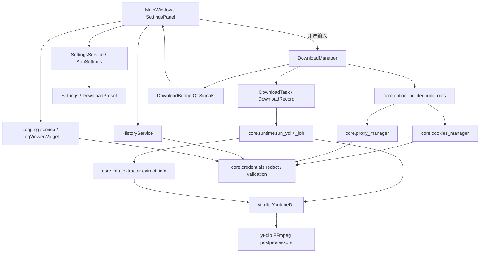

# B1 Architecture Cleanup & Product Foundation

日期：2026-10-02。基线4f80045be34543f3d8925795174d6ab78f22aa79，开始git status干净；分支codex/b1-architecture-cleanup。master、B0、B0.1、B0.2引用不改。未新增依赖、平台、账号、数据库、更新器或UI美化。

## Before

```text
main.py
gui/main_window.py           GUI、参数fallback、任务/历史协调
gui/widgets/settings_panel.py  控件读取 + 130行yt-dlp参数映射
configs/ydl_opts.py          通用转换 + Cookies处理
configs/app_settings.py      JSON长期设置
configs/presets.py           预设可能包含长期设置
core/manager.py              ThreadPoolExecutor、去重、取消
core/task.py                 pending/running/completed/failed/canceled
core/runtime.py              Windows spawn + yt-dlp/FFmpeg PP
core/history.py              JSON历史、旧状态字符串
gui/widgets/log_viewer.py    logging handler直接操作Qt控件
```

## After

```text
main.py                      QApplication/日志初始化（入口不机械搬迁）
gui/                         现有布局、输入/显示、Qt桥接；无yt-dlp/subprocess调用
core/option_builder.py       唯一参数映射与转换
core/cookies_manager.py      原生Cookie来源、验证、安全展示、支持政策
core/proxy_manager.py        URL解析/验证、原生option、安全展示
core/manager.py              DownloadManager：队列/并发/取消/去重/retry/events
core/task.py                 DownloadTask：执行与DownloadRecord协调
core/runtime.py              yt-dlp Adapter：run_ydl/_job/错误映射/终止
core/info_extractor.py       Adapter的Preview helper（无第二下载实现）
core/ffmpeg_utils.py         原有发现模块扩充：配置路径、版本、ffprobe验证
models/download.py          DownloadRecord / 唯一TaskStatus
models/format.py            FormatProfile字段接口，无排序
models/settings.py          Settings / DownloadPreset / protected keys
models/errors.py            内部DownloadError及专用错误类型
services/history_service.py HistoryService：复用JSON存储
services/settings_service.py SettingsService：复用AppSettings，typed projection/merge
services/logging_service.py  SafeFormatter、1MiB×4 rotating file logs
configs/ydl_opts.py          旧import兼容导出，无第二实现
core/history.py             旧DownloadHistory import兼容导出
```

只移动option builder与history两个职责模块；其余稳定文件保留原位置。manager/task/runtime已同等承担目标目录建议职责，不新建平行download_manager/downloader等空包装。main入口与pyproject脚本保持兼容。

## 实际调用与边界



SettingsPanel.collect_opts现在仅返回collect_settings_dict用户输入；目录→paths、embed_subs→embedsubtitles、默认bv+ba、认证/网络类型映射全部在core。MainWindow通过DownloadManager.build_options发命令；Preview/Download/Retry同一入口。UI不读取Cookie库，不解析proxy，不启动FFmpeg/subprocess。FormatPreviewDialog只显示真实formats和用户选项，不实现排名。

DownloadManager callback接口保持兼容，新增task_added/task_updated/task_progress/task_completed/task_failed/task_cancelled经DownloadBridge转Qt Signal；内部错误另有typed_error signal。核心无Qt依赖。UI不轮询任务状态；live验证脚本的QTimer轮询是测试监视器，不是产品实现。

## 保留的下载逻辑与状态变更

继续调用原生YoutubeDL.download，FFmpeg merge/remux/extract仍由yt-dlp PP执行，保留50ms取消轮询、Windows自有PID树taskkill、输出after_move检查、原生.part恢复。没有第二merge engine，没有强制scale/fps/codec转换。

仅增加before_dl ReadyPP发送安全metadata与阶段事件，postprocessor hooks更新模型；error IPC从str改为安全code/message。这影响task/hook，因此按用户要求重新完整8K下载、三阶段cancel/resume、ffprobe和全片decode。详细证据见REGRESSION。

状态统一到8个规范值，旧pending/running/canceled/interrupted仅在TaskStatus.normalize与enum import aliases兼容。History加载归一化；活跃旧记录在GUI恢复时标cancelled而非装作已完成。terminal不能重启，只能新ID Retry。queued取消立即终态，活动任务在实际进程停止后终态。

## 日志、设置与错误

- SettingsService继承现有AppSettings JSON机制；Settings是typed投影，DownloadPreset只包含预设负责的key，protected设置不能被预设覆盖。没有新增第二store。
- HistoryService明确add_record/update_record/list_records/clear_history接口，存title/url/quality/status/output_path/date/error；敏感额外字段丢弃，URL/error脱敏，list返回深拷贝。避免每个progress都重复保存相同title。
- 文件日志由main配置rotating handler；终态/错误进入desktop logger，DEBUG/INFO/WARNING/ERROR formatter统一脱敏。GUI日志最多2000块，logging handler经Qt queued Signal投递，close移除handler。
- Adapter按实际异常类型及cause/context映射CookieError/ProxyError，FFmpeg缺失用FFmpegError，其他保守归DownloadError；不靠UI字符串猜stderr。FormatError/AuthenticationError接口保留，B2再补精确分类。不会把通用postprocessing失败一律猜成FFmpeg异常。
- 浏览器Cookie失败保留底层原因并提示“无法直接读取浏览器 Cookies。请导出 cookies.txt 后重试。”；file正式、Firefox Best Effort、Chrome/Edge实验性政策不变。

## 依赖与范围

pyproject.toml仅PySide6（Qt）、PyYAML（现有YAML defaults）、yt-dlp（下载/PP）三个直接依赖，均有源码引用，未发现可证明闲置项；不存在requirements.txt，不虚构删除或升级。FFmpeg/ffprobe仍为外部已安装工具。

SponsorBlock/章节拆分仅移除首版UI入口，其原生适配与既有PP构造测试保留为Defer。其它高级功能依赖设置持久化/预设，先清点并Defer，不为删代码破坏核心。完整B2格式策略和页面拆分不实现。开放问题及B2影响见REGRESSION。
