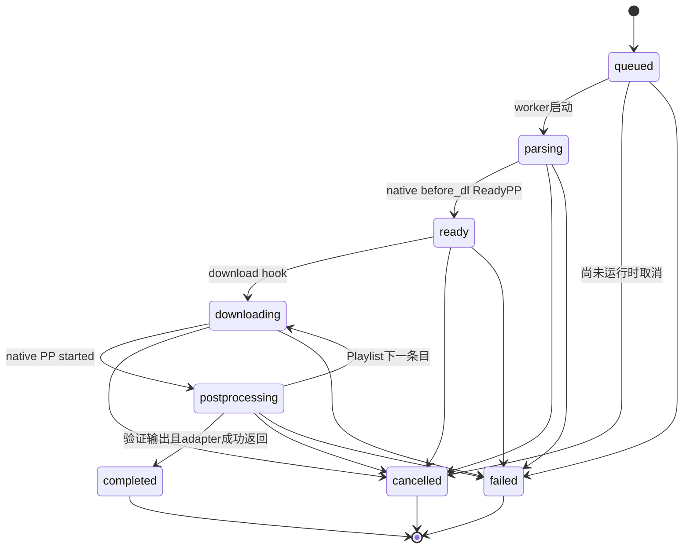

# B1 Task State Machine

唯一生产定义：`models.download.TaskStatus`。统一记录：`DownloadRecord`；执行器`DownloadTask.record`持有该模型。所有UI/manager/history终态判断共用TaskStatus，不各自新增状态。

固定序列queued/parsing/ready/downloading/postprocessing/completed/failed/cancelled。Playlist一个URL任务包含多个媒体，允许postprocessing→downloading表示下一条目，不是终态复活；最外层completed仍等待整个URL执行成功。实际skip-existing或audio/premux缓存场景缺少部分hooks时，成功返回前补齐阶段转换；不能把补齐的阶段解释成文件被重新下载。before_dl hook仅发安全metadata，不另跑一次extractor。

任何非terminal可failed/cancelled；terminal只允许重复同状态幂等，不允许变成其它状态。`DownloadRecord.transition`检查邻接及合法playlist循环。DownloadTask.run只能启动queued且run_lock保证只一次。

queued取消在未被worker占用时立即cancelled；活动cancel先设置event，adapter停止拥有的进程并join之后才cancelled。CancelledError独立内部类型；不会当下载失败。ReadyPP、progress100%、PP started/finished都不直接completed；必须native returncode0、after_move非空output、result IPC、child exit0、未取消。

旧pending→queued、running→parsing、canceled/interrupted→cancelled仅用于旧JSON读取/enum名称兼容；新写入均规范值。重启恢复非terminal旧记录在GUI标cancelled并注明应用中断，不能认为它仍有活worker。Retry创建全新ID，不做failed/cancelled→completed。

模型字段：id/url/title/thumbnail/status/progress/speed/eta/downloaded_bytes/total_bytes/quality/format_label/output_path/created_at/started_at/completed_at/error。时刻用UTC ISO8601；旧history timestamp保留兼容。quality等来自真实metadata；label现为原生format_id占位，不做B2排序或虚构画质。

验证：原状态测试迁移为完整规范序列（仍同一测试）；新增终态拒绝/未来8640P模型检查；真实GUI取消与Retry、真实FFmpeg失败、8K三阶段取消和完整解码。历史B0.1/B0.2的单l canceled记录不改写文档事实。
